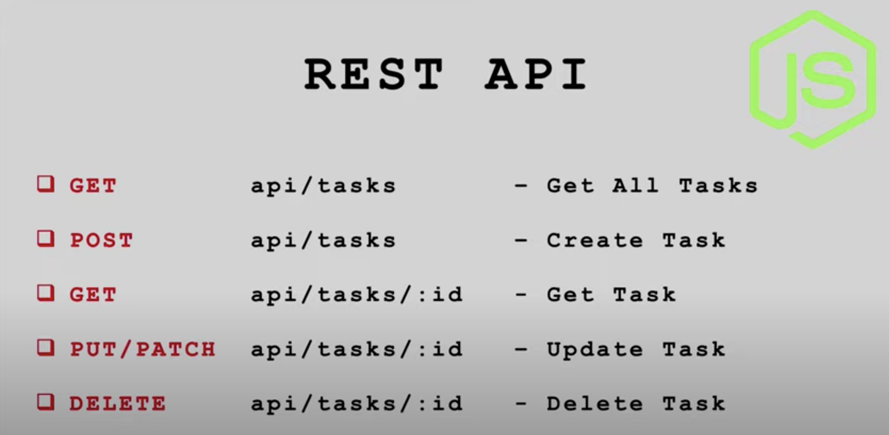
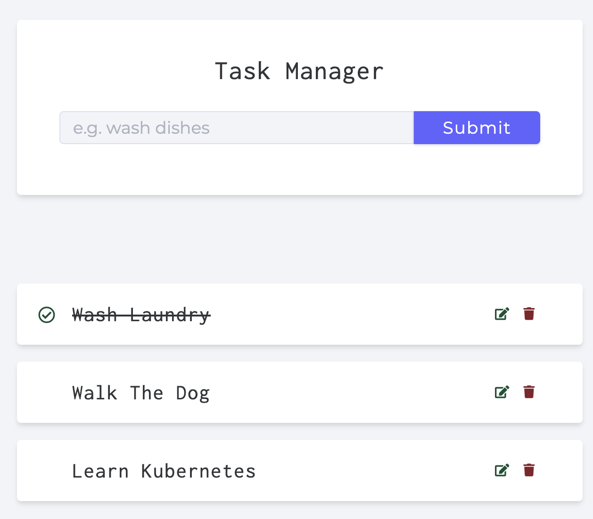
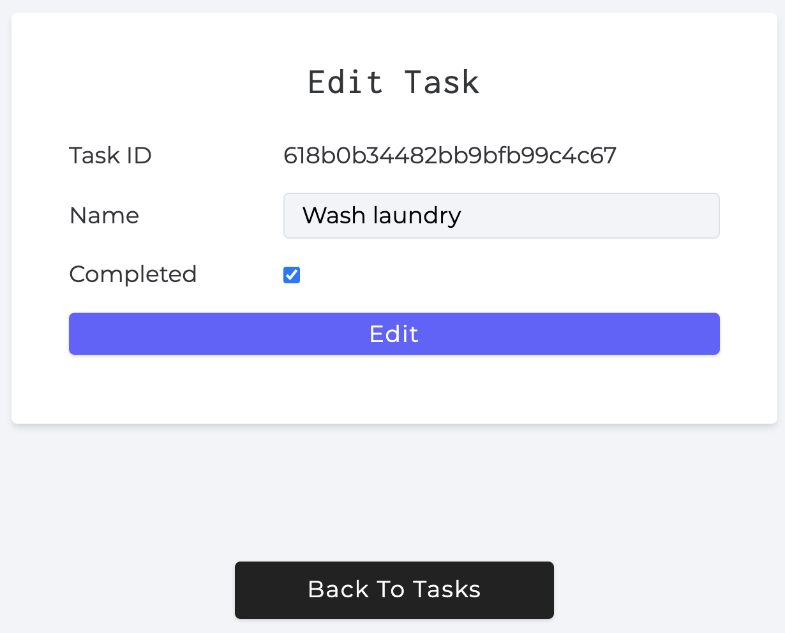

# Task Manager

A NodeJS Backend application with CRUD capability.
Taken from: https://www.udemy.com/course/nodejs-tutorial-and-projects-course/?referralCode=E94792BEAE9ADD204BC7

  

## Stack

- Backend - NodeJS
- Framework - Express
- ORM - Mongoose
- Database - MongoDb (Cloud)

## Screenshots

  
  

